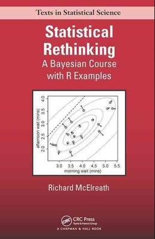

# Statistical Rethinking Book Solutions

Statistical Rethinking by Richard Mcelreath is one of the best books I have read on Statistical Inference. Here are some end of chapter solutions compiled:

* [Chapter 5: Multivariate Linear Models](chapter_05)
* [Chapter 6: Overfitting, Regularization and Information Criteria](chapter_06)

Solutions by: Amit Kushwaha